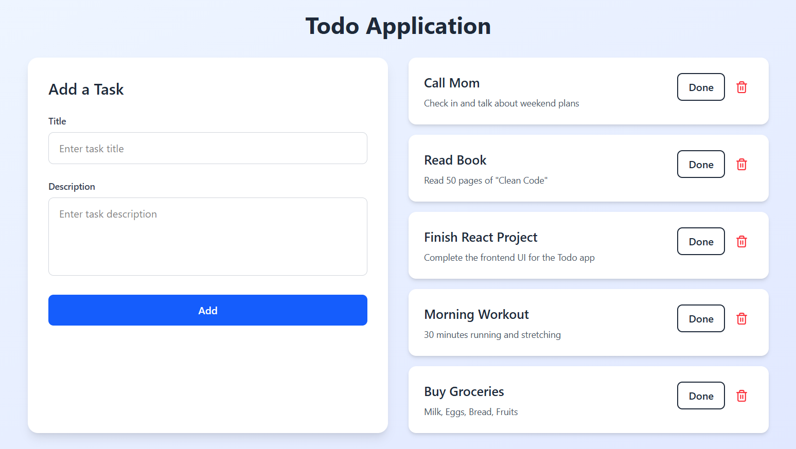

# 📝 Todo Application

A full-stack Todo application built using **Spring Boot (Backend)**, **React (Frontend)**, and **PostgreSQL (Database)** — containerized using **Docker Compose**.  

The frontend uses **Framer Motion** for animations, **Axios** for API calls, and **Lucide React** for icons. The backend uses **Spring Data JPA**, **Spring Web**, **PostgreSQL Driver**, and **Lombok** for clean code.

---

## UI



---

## 🚀 Features

- Add, edit, delete tasks
- Persistent storage with PostgreSQL
- RESTful API built with Spring Boot
- Responsive UI built with React + Vite
- Smooth animations with Framer Motion
- Axios for API communication
- Icons with Lucide React
- Dockerized for easy deployment

---

## 🛠️ Tech Stack

**Frontend:** React, Vite, Tailwind CSS, Framer Motion, Axios, Lucide React  
**Backend:** Spring Boot, Spring Data JPA, Spring Web, Lombok, PostgreSQL Driver  
**Database:** PostgreSQL  
**Containerization:** Docker, Docker Compose  

---

## 📁 Project Structure


---

## ⚙️ Getting Started (Local Development)

### 1️⃣ Clone the repository

```bash
git clone https://github.com/Nipuna7/Todo-Application.git
cd todo-app

## 🚀 Running the Application

### 2️⃣ Run Backend Locally
```bash
cd backend
mvn spring-boot:run

### 3️⃣ Run Frontend Locally
cd frontend/my-app
npm install
npm run dev

---

## 🐳 Docker Setup 

Make sure **Docker** is installed and running.

### 1️⃣ Build and Start All Services
```bash
docker compose up --build -d

### 2️⃣ Access the App

- **Frontend** → [http://localhost:5173](http://localhost:5173)
- **Backend API** → [http://localhost:8080](http://localhost:8080)

### 3️⃣ Stop Containers
docker compose down


### 🔧 Environment Variables

| Variable                   | Description              | Default                                      |
| -------------------------- | ------------------------ | -------------------------------------------- |
| SPRING_DATASOURCE_URL       | PostgreSQL connection URL | jdbc:postgresql://todo-postgres:5432/todo_db |
| SPRING_DATASOURCE_USERNAME  | Database username         | postgres                                     |
| SPRING_DATASOURCE_PASSWORD  | Database password         | 0000                                         |
| VITE_API_URL                | Backend API URL           | http://backend:8080                          |


